# Trabalhando com Objetos

## Referência: Curso de Desenvolvimento Java, Giuliana Silva Bezerra
[Compre aqui](https://www.udemy.com/course/curso-de-desenvolvimento-java/)
<hr>

## Tópicos

- [Orientação à Objeto](#orientação-à-objeto-oo)
- [Vantagens da OO](#vantagens-da-oo)
- [Classes](#classes)
- [Relação entre Classe e Objeto](#qual-a-relação-entre-classes-e-objetos)
- [Atributos](#atributos)
- [Métodos](#métodos)
- [Construtor Padrão](#construtores-padrão)
- [Construtor com Parâmetros](#construtores-com-parâmetros)
- [Valor Padrão dos Atributos](#valores-padrão-de-atributos)
- [Pacotes](#pacotes)
- [Membros Publicos (Public)](#membros-públicos)
- [Tipos de Atributo (Primitivo vs Referência)](#tipos-de-referência)
- [Wrapper Classes](#wrapper-classes-)
- [Modificadores Static](#modificador-static-método-static-e-atributo-static)
  - [Atributo](#atributo-static)
  - [Método](#método-static)
  - [Bloco](#bloco-static)
- [Arrays São Objetos](#arrays-são-objetos)
- [Arrays de Primitivos](#arrays-de-primitivos)
- [Arrays de Objetos](#arrays-de-objetos)
- [Igualdade entre Objetos](#igualdade-entre-objetos)
- [Igualdade entre Arrays](#igualdade-entre-arrays)
<hr>

## Orientação à Objeto (OO)

Ao invés de colocarmos a lógica de tudo dentro do Main ou em uma função como na **estrutura procedural**: 
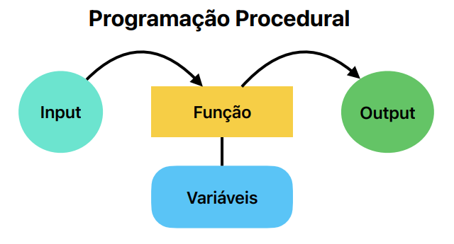

Nós criaremos um objeto
para que ele esteja encarregado de fazer as operações necessárias. Onde somente iremos chamar ele 
dentro do Main depois.

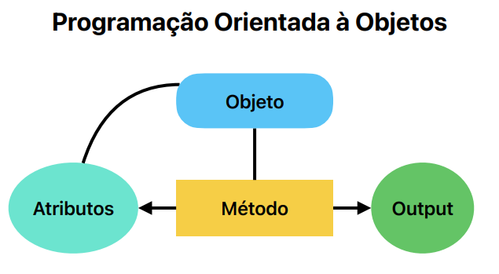

Se temos uma calculadora, por exemplo, criamos um objeto Calculadora e dentro dele terá os métodos de 
operação.

**Em suma, mover dados, métodos, comportamentos para dentro de um objetos específicos.**

## Vantagens da OO

Fazendo isso, teremos uma estrutura mais clara, boa legibilidade do código, podemos fazer reuso dos métodos
e tudo terá uma boa coesão.

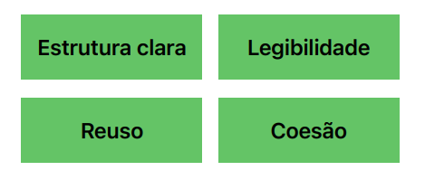

## Classes

Classes representam conceitos, coisas do mundo real: Usuário, Produto, Compra, Carrinho, Calculdora...

### Qual a relação entre classes e objetos?

Bom, classe em suma é o manual que a gente usa (JVM) para criar os objetos.

Por exemplo, uma Classe específica pode ser uma planta de uma casa. E com essa planta, construiremos VÁRIAS
casas. E as casas, neste contexto, são os objetos.

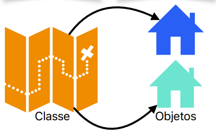

## Atributos
### O que a Classe possui? Qual sua estrutura? O que ela pode fazer?

Classes possuem atributos, ou seja, características dela. Já que estamos no conceito de Planta/Casa...
Uma casa pode ter uma sala, quarto, cozinha ou banheiro. Isso são características dela (atributos).


Numa classe **Compra**, por exemplo, que tipo de atributos poderiamos ter? Poderiamos ter atributos de nome do
produto, valor, quantidade e por aí vai.

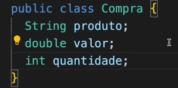

Já um **Usuário**, pode ter um username, email e password.

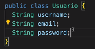
<hr>

## Métodos
### Ok, e como definimos o que essa Classe irá fazer?

Métodos são operações, funções. Ainda no exemplo de casa, uma casa terá que acender a luz, trancar a porta,
ativar alarme.... isso serão métodos dentro da Classe.


Uma Casa, por exemplo, pode ser uma casa inteligente, com comandos de voz. Podemos criar um atributo boolean
para identificar isso dentro de um método.
```java
public class Casa {
    boolean inteligente;
    
    void ascenderLuz() {
        if (inteligente) {
            System.out.println("Comando de Voz.");
        }
        else {
            System.out.println("Usar interruptor.");
        }
    }
}
```

Os métodos podem retornar qualquer coisa. Se fosse um "int" ao invés de void acima, teriamos que colocar
para ele retornar um inteiro no final da função.

Além disso, dentro dos (), podemos passar parâmetros para o método ler. Exemplo, podemos colocar qual parte
da casa ele irá acender a luz colocando (int comodo).
<hr>

## Construtores Padrão
### Como usar esse Objeto/Classe?

Construtores são usados para criar objetos e executálos. **As classes serão instanciadas no método Main**.

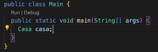

Ok, nós instanciamos. E para construir esse objeto? Passaremos um "= new Casa()"

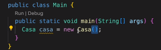

**Todas as classes possuem ao menos um construtor padrão sem argumentos (parâmetros).**

A partir desse momento, nós podemos acessar os métodos dessa classe, chamando a variável e passando um "."

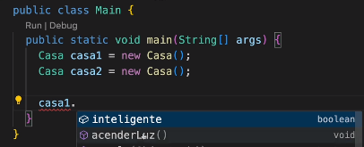
<hr>

## Construtores com Parâmetros

Dentro da classe Casa, nós criaremos um construtor com argumentos. Podemos selecionar quais queremos que
estejam ali dentro. Ou seja, se temos 4 atributos, podemos colocar só 3 se desejarmos.

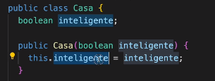

**Isso é importante:** Que fique claro, o (boolean inteligente) é somente um parâmetro do construtor.
Para atribuirmos o valor desse parâmetro, para o atributo inicial da nossa clase, usamos o **this.**

O this irá falar com o objeto que estamos (Casa), o "." é o acesso, onde neste caso, acessamos o atributo
inteligente e atualizamos o valor dele, para o do parâmetro.

Ao voltarmos para o Main, podemos dessa vez, passar parâmetros dentro da instanciação da classe:

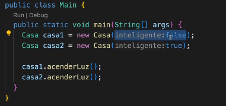

Lembrar que, ao criamos um construtor com argumentos, não será possível iniciar no Main um objeto sem 
parâmetros. Para que seja possível, precisamos criar dentro do nosso Objeto, um construtor padrão
sem argumentos, vazio mesmo.

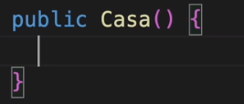
<hr>

## Valores Padrão de Atributos

Os atributos nos objetos são inicializados com valores default. Um boolean por exemplo, sempre irá 
iniciar **false**, uma String **null** e por aí vai.

Então a ideia é a partir de agora, a gente inicializar esses atributos. Declarou no objeto? Informe
os valores.
<hr>

## Pacotes

Nesse exemplo do estudo aqui, estamos usando conceito de Casa. Podemos criar pacotes específicos para tais
coisas, como: Pacote chamado Moradias, onde terá: Casa, Apartamento, Trailer...

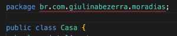

Cada "." é uma divisão ou "/", de pasta. br/com/giulianabezerra/moradias/Casa.java
<hr>

## Importando Pacotes

Se colocamos um objeto dentro de um pacote específico precisamos passar isso ao main (importar ele), pois
o Main está alocado no Default.

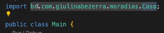
<hr>

## Membros Públicos

Nota-se que quando criamos os nossos atributos, não declaremos o tipo deles (public/private). Se não há nenhuma
declaração, não é possível acessá-los de outras Classes.

Public - Qualquer pessoa/classe pode acessar, torna a classe visível para quem está fora do pacote.
Então agora, os métodos e atributos serão public, podendo ser acessados.

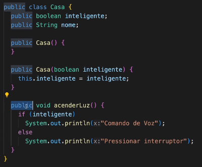
<hr>

## Tipos de Referência

Nós temos alguns tipos de variáveis:

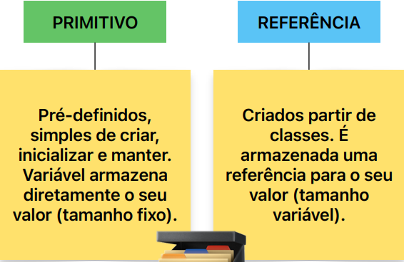

Qual referência é armazenada?

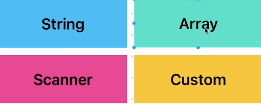

### Ok, qual a diferença de Primitivo vs Referência?
Bom, eles possuem estados e comportamentos definidos por classes.

Os primitivos só irão guardar valores.

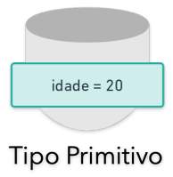

Já referência, podemos ter vários atributos e métodos associados a este valor.

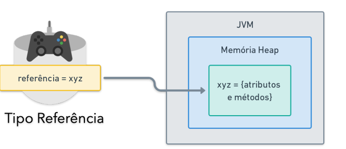

### Detalhando isso
Vamos pensar numa **Classe Café**.

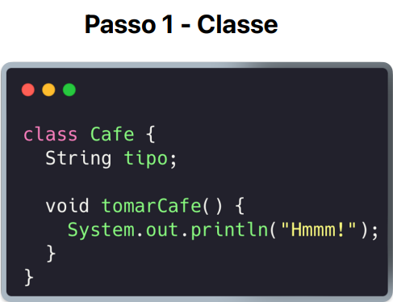

Como criamos essa classe, podemos instanciar ela agora.

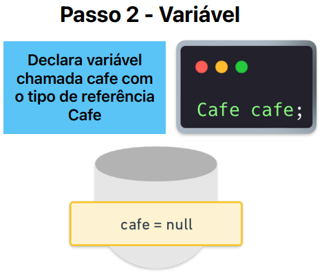

Mas como não foi atribuído nenhum valor, será inicialmente null. Não terá nenhuma referência, nenhum
espaço na JVM.

Então iremos para o passo 3:

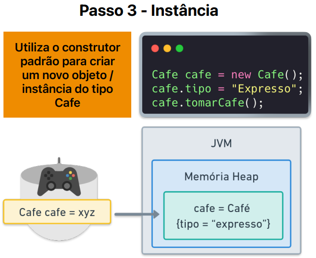
<hr>

## Wrapper Classes 

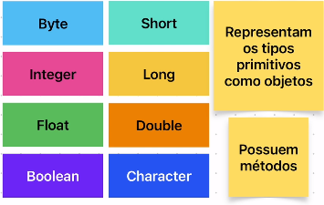

Ao invés de declararmos: ```private int idade``` usaremos o tipo wrapper: ```private Integer idade```

A partir do momento que utilizamos wrapper classes poderemos usar métodos desses tipos.

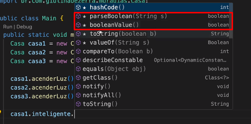

A partir de agora, não teremos mais um valor default. Precisaremos sempre inicializar esse objeto ao declará-lo.
<hr>

## Modificador Static, Método Static e Atributo Static

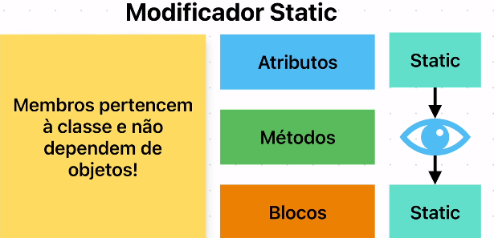

**Ao usarmos static, criamos membros que pertencem à classe e não dependem de objetos.**

### Método Static
Por exemplo, imagine que a gente tenha uma classe Matemática e dentro dela teremos um método de soma:

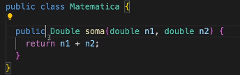

Inicialmente, teriamos que instanciar o objeto Matematica para utilizar esse método.

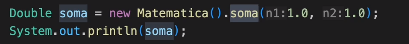

Mas, ao declararmos ```public static Double soma```, podemos chamar sem instanciar/criar o Objeto Matematica:

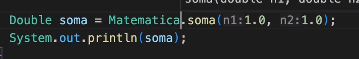

## Atributo Static

Ok, em cima foi um método, mas e com atributos?

Bom, vamos supor que a nossa calcula tem um limite de resultado na soma.

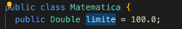

Para averigurar isso, passamos dentro do método uma condicional.

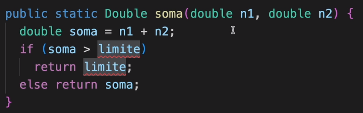

Conforme visto acima, isso dá um erro, por que?

Bom, como aprendemos acima, vimos que métodos estaticos não dependem de instancias. Então se não existe nenhuma
instancia da classe Matematica criada, não será possivel acessar também, seus atributos. Esse atributo "limite",
será estatico. E existirá independente da classe Matematica ter sido instanciada ou não. E será possível 
utilizá-lo.

Portanto, métodos estáticos só acessam métodos/atributos estáticos.

Por sua vez, metodos não estáticos, podem acessar estáticos.
<hr>

## Quando usar Static e Final?

O valor limite declarado acima, por mais que seja estático, pode acabar sendo utilizado num método não estático
tendo seu valor inicial alterado. Para que não seja possível reatribuir seu valor, passamos "final", no mesmo.
Além diso, é comum variáveis do tipo final ter SNAKE_CASE. 

Essa variável ficaria, portanto: ```public static final Double LIMITE_OPERACAO = 100.0```

**O Static também pode ser utilizado em classes utilitárias. Classes utilitárias são úteis porém o ideal é sempre
depender da instanciação do objeto.**

## Bloco Static

Sabe essa variável static limite? Imagine que a gente quer calcular ela antes de inicializar. Bom, criariamos
um bloco Static e fariámos toda a logica de conta. Esse bloco pode ser acessado dentro da classe Main.

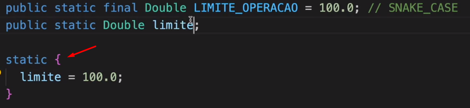

**Não é recomendável utilizar, pois é complicado depurar um erro inicializando um atributo dessa maneira.**
<hr>

## Arrays São Objetos

Os arrays possuem dentro deles, tipos primitivos. Mas o Array como um todo é um tipo de referência, pois é
definido por uma classe.

Cada posição dentro do Array, é um objeto.

## Arrays de Primitivos

Existe uma forma mais simples de percorrer e imprimir um Array.

Usaremos uma classe utilitária que possui vários métodos estaticos: Arrays.

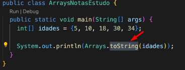

## Arrays de Objetos

Criamos um Objeto (classe), Gato. E dentro do Main criaremos um Array desse tipo.

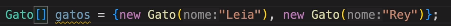

Aqui o .toString do Arrays não funcionará. Pois ele é um array de objetos.

Criaremos um toString dentro da Classe Gato e assim o .toString irá funcionar :).
<hr>

## Igualdade entre Objetos

Todos os objetos são "objects" e possuem acesso ao .equals, e sempre que compararmos, dará false. Pois possuirão
objetos de memória diferentes.

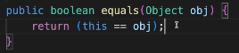

Teremos que "criar" nosso próprio equals, contendo um hashCode. 

hashCode é um código específico gerado pela linguagem para cada objeto. Se os objetos são iguais... em tese
o hashCode será igual também.

Então dentro da Classe criaremos um método equals and HashCode, e poderemos escolher qual o critério a ser usado.
Se quer comparar Id com Id, Username com Username e por aí vai. 

## Igualdade entre Arrays

Para comparar Arrays, precisamos comparar elemento a elemento. utilizaremos Arrays.equals(array1, array2),
por exemplo.

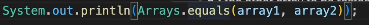

Destacando que no objeto principal (Usuario), por exemplo, TEM QUE TER A IMPLEMENTAÇÃO DO EQUALS E HASHCODE.
