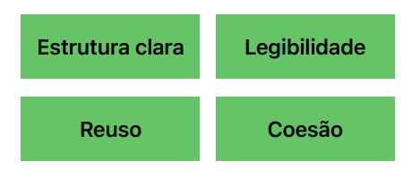

# Trabalhando com Objetos

## Orientação à Objeto (OO)

Ao invés de colocarmos a lógica de tudo dentro do Main ou em uma função como na **estrutura procedural**: 


Nós criaremos um objeto
para que ele esteja encarregado de fazer as operações necessárias. Onde somente iremos chamar ele 
dentro do Main depois.


Se temos uma calculadora, por exemplo, criamos um objeto Calculadora e dentro dele terá os métodos de 
operação.

**Em suma, mover dados, métodos, comportamentos para dentro de um objetos específicos.**

## Vantagens da OO

Fazendo isso, teremos uma estrutura mais clara, boa legibilidade do código, podemos fazer reuso dos métodos
e tudo terá uma boa coesão.



## Classes

Classes representam conceitos, coisas do mundo real: Usuário, Produto, Compra, Carrinho, Calculdora...

### Qual a relação entre classes e objetos?

Bom, classe em suma é o manual que a gente usa (JVM) para criar os objetos.

Por exemplo, uma Classe específica pode ser uma planta de uma casa. E com essa planta, construiremos VÁRIAS
casas. E as casas, neste contexto, são os objetos.


## Atributos
### O que a Classe possui? Qual sua estrutura? O que ela pode fazer?

Classes possuem atributos, ou seja, características dela. Já que estamos no conceito de Planta/Casa...
Uma casa pode ter uma sala, quarto, cozinha ou banheiro. Isso são características dela (atributos).


Numa classe **Compra**, por exemplo, que tipo de atributos poderiamos ter? Poderiamos ter atributos de nome do
produto, valor, quantidade e por aí vai.


Já um **Usuário**, pode ter um username, email e password.


<hr>

## Métodos
### Ok, e como definimos o que essa Classe irá fazer?

Métodos são operações, funções. Ainda no exemplo de casa, uma casa terá que acender a luz, trancar a porta,
ativar alarme.... isso serão métodos dentro da Classe.


Uma Casa, por exemplo, pode ser uma casa inteligente, com comandos de voz. Podemos criar um atributo boolean
para identificar isso dentro de um método.
```java
public class Casa {
    boolean inteligente;
    
    void ascenderLuz() {
        if (inteligente) {
            System.out.println("Comando de Voz.");
        }
        else {
            System.out.println("Usar interruptor.");
        }
    }
}
```

Os métodos podem retornar qualquer coisa. Se fosse um "int" ao invés de void acima, teriamos que colocar
para ele retornar um inteiro no final da função.

Além disso, dentro dos (), podemos passar parâmetros para o método ler. Exemplo, podemos colocar qual parte
da casa ele irá acender a luz colocando (int comodo).
<hr>

## Construtores Padrão
### Como usar esse Objeto/Classe?

Construtores são usados para criar objetos e executálos. **As classes serão instanciadas no método Main**.


Ok, nós instanciamos. E para construir esse objeto? Passaremos um "= new Casa()"


**Todas as classes possuem ao menos um construtor padrão sem argumentos (parâmetros).**

A partir desse momento, nós podemos acessar os métodos dessa classe, chamando a variável e passando um "."


<hr>

## Construtores com Parâmetros

Dentro da classe Casa, nós criaremos um construtor com argumentos. Podemos selecionar quais queremos que
estejam ali dentro. Ou seja, se temos 4 atributos, podemos colocar só 3 se desejarmos.


**Isso é importante:** Que fique claro, o (boolean inteligente) é somente um parâmetro do construtor.
Para atribuirmos o valor desse parâmetro, para o atributo inicial da nossa clase, usamos o **this.**

O this irá falar com o objeto que estamos (Casa), o "." é o acesso, onde neste caso, acessamos o atributo
inteligente e atualizamos o valor dele, para o do parâmetro.

Ao voltarmos para o Main, podemos dessa vez, passar parâmetros dentro da instanciação da classe:


Lembrar que, ao criamos um construtor com argumentos, não será possível iniciar no Main um objeto sem 
parâmetros. Para que seja possível, precisamos criar dentro do nosso Objeto, um construtor padrão
sem argumentos, vazio mesmo.


<hr>

## Valores Padrão de Atributos

Os atributos nos objetos são inicializados com valores default. Um boolean por exemplo, sempre irá 
iniciar **false**, uma String **null** e por aí vai.

Então a ideia é a partir de agora, a gente inicializar esses atributos. Declarou no objeto? Informe
os valores.
<hr>

## Pacotes

Nesse exemplo do estudo aqui, estamos usando conceito de Casa. Podemos criar pacotes específicos para tais
coisas, como: Pacote chamado Moradias, onde terá: Casa, Apartamento, Trailer...


Cada "." é uma divisão ou "/", de pasta. br/com/giulianabezerra/moradias/Casa.java
<hr>

## Importando Pacotes

Se colocamos um objeto dentro de um pacote específico precisamos passar isso ao main (importar ele), pois
o Main está alocado no Default.


<hr>

## Membros Públicos

Nota-se que quando criamos os nossos atributos, não declaremos o tipo deles (public/private). Se não há nenhuma
declaração, não é possível acessá-los de outras Classes.

Public - Qualquer pessoa/classe pode acessar, torna a classe visível para quem está fora do pacote.
Então agora, os métodos e atributos serão public, podendo ser acessados.


<hr>

## Tipos de Referência

Nós temos alguns tipos de variáveis:


Qual referência é armazenada?


### Ok, qual a diferença de Primitivo vs Referência?
Bom, eles possuem estados e comportamentos definidos por classes.

Os primitivos só irão guardar valores.


Já referência, podemos ter vários atributos e métodos associados a este valor.


### Detalhando isso
Vamos pensar numa **Classe Café**.


Como criamos essa classe, podemos instanciar ela agora.


Mas como não foi atribuído nenhum valor, será inicialmente null. Não terá nenhuma referência, nenhum
espaço na JVM.

Então iremos para o passo 3:

